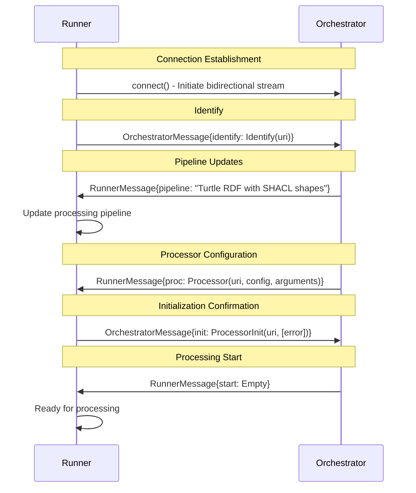
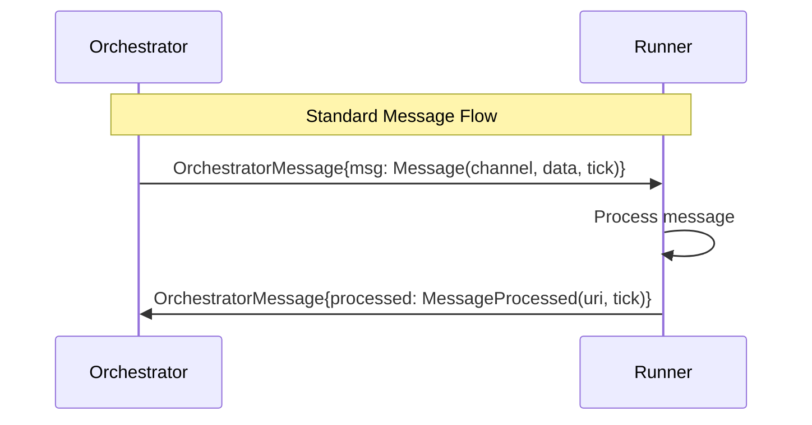
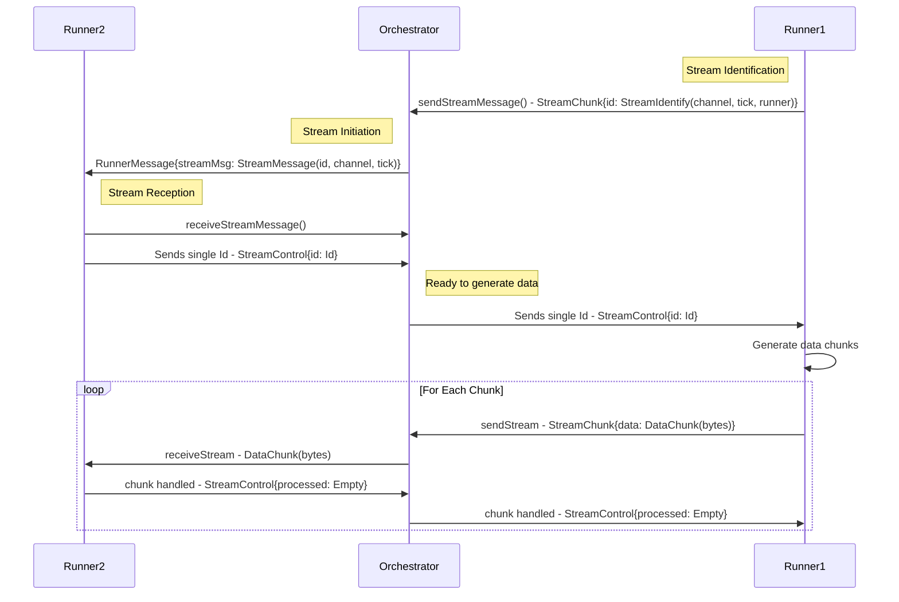
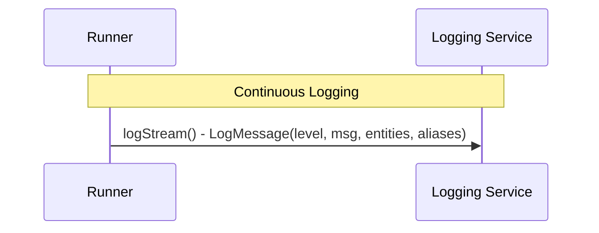

# RDF-Connect Protobuf Files

RDF-Connect is a distributed RDF (Resource Description Framework) processing system that enables streaming data processing with real-time orchestration and logging capabilities.

Full specification detailing the implementations can be found on [here](https://rdf-connect.github.io/specification/).

## Core Capabilities

### 🚀 **Distributed Processing Architecture**
- **Orchestrator-Runner Model**: Centralized orchestration with distributed execution
- **Processor Lifecycle Management**: Dynamic processor initialization, configuration, and lifecycle control
- **Bidirectional Streaming**: Full-duplex communication between orchestrators and runners

### 📡 **Advanced Message Routing**
- **Channel-Based Routing**: Messages routed through logical channels with sequence numbering
- **Tick Sequencing**: Built-in message ordering and deduplication support
- **URI-Based Identification**: Unique component identification system

### 🌊 **Streaming Data Protocol**
- **Chunked Streaming**: Efficient streaming of large datasets with identification
- **Stream Identification**: Each stream has unique channel and tick identifiers
- **Data Chunking**: Optimized data transmission with metadata preservation

### 🔧 **Robust Error Handling**
- **Built-in Error Reporting**: Comprehensive error handling throughout the protocol
- **Graceful Degradation**: Optional error fields allow for partial success scenarios
- **Service-Level Error Propagation**: Errors bubble up through the service interface

### 📊 **Pipeline Management**
- **Turtle Format Support**: Full pipeline information in Turtle RDF serialization
- **SHACL Integration**: Built-in support for SHACL (Shapes Constraint Language) validation
- **Dynamic Pipeline Updates**: Runtime pipeline modification capabilities

### 📝 **Comprehensive Logging**
- **Dedicated Log Streams**: Separate logging channels for debugging and monitoring
- **Structured Logging**: Log messages with levels, entities, and aliases
- **Real-time Log Streaming**: Continuous log streaming for live monitoring

## Protocol Components

### Core Message Types

#### `common.proto` - Base Protocol Definitions
- `Message`: Core message structure with channel, data, and tick
- `Error`: Error reporting with cause description
- `Close`: Channel closure signaling
- `StreamIdentify`: Stream identification and metadata
- `StreamChunk`: Chunked streaming data container
- `MessageProcessed`: Processing acknowledgment with tick
- `DataChunk`: Raw data chunk for streaming
- `StreamMessage`: Stream message with ID and metadata

#### `orchestrator.proto` - Orchestration Layer
- `ProcessorInit`: Processor initialization with URI and optional error
- `Identify`: Component identification
- `OrchestratorMessage`: Main orchestration message container

#### `runner.proto` - Execution Layer
- `Processor`: Processor definition with URI, config, and arguments
- `RunnerMessage`: Main runner message container

#### `service.proto` - Service Interface
- `Id`: Simple ID message for stream identification
- `LogMessage`: Structured logging with levels and entity tracking
- `StreamControl`: Control messages for stream messages
- `Runner` Service: Main service interface with 4 RPC methods

## Message Flow Diagrams

### Startup Sequence

### Message Processing Flow

### Streaming Message Flow

### Logging Flow

## Service Interface

### Core RPC Methods

#### `connect(stream OrchestratorMessage) returns (stream RunnerMessage)`
- **Purpose**: Main bidirectional communication channel
- **Flow**: Orchestrator ↔ Runner message streaming
- **Use Case**: Primary orchestration and execution communication

#### `sendStreamMessage(stream StreamChunk) returns (stream Id)`
- **Purpose**: Send streaming data with identification
- **Flow**: StreamChunk (StreamIdentify/DataChunk) → stream of acknowledgments
- **Use Case**: Chunked data transmission with metadata

#### `receiveStreamMessage(Id) returns (stream DataChunk)`
- **Purpose**: Receive streaming data by ID
- **Flow**: Request ID → stream of DataChunk responses
- **Use Case**: Retrieve specific data streams

#### `logStream(stream LogMessage) returns (google.protobuf.Empty)`
- **Purpose**: Structured logging stream
- **Flow**: Continuous LogMessage stream → Empty acknowledgments
- **Use Case**: Real-time monitoring and debugging

## Protocol Features

### Error Resilience
- All critical operations include optional error fields
- Graceful error propagation through the service interface
- Non-blocking error handling for continued operation

### Performance Optimizations
- Chunked streaming reduces memory overhead
- Tick-based sequencing enables efficient message ordering
- Channel-based routing minimizes message routing overhead

### Extensibility
- Oneof message patterns allow for future protocol extensions
- Modular design supports easy addition of new message types
- URI-based component identification supports dynamic scaling

## Integration Patterns

### Typical Usage Flow
1. **Setup**: Runner connects to Orchestrator via `connect()`
2. **Configuration**: Orchestrator sends processor configuration
3. **Initialization**: Runner confirms initialization status
4. **Processing**: Bidirectional message exchange begins
5. **Streaming**: Data streams established as needed
6. **Logging**: Continuous logging for monitoring
7. **Shutdown**: Graceful channel closure

### Error Scenarios
- **Initialization Failure**: ProcessorInit with error field populated
- **Processing Errors**: Error messages in message streams
- **Connection Issues**: Automatic reconnection with tick synchronization
- **Stream Failures**: Individual stream closure without affecting others
